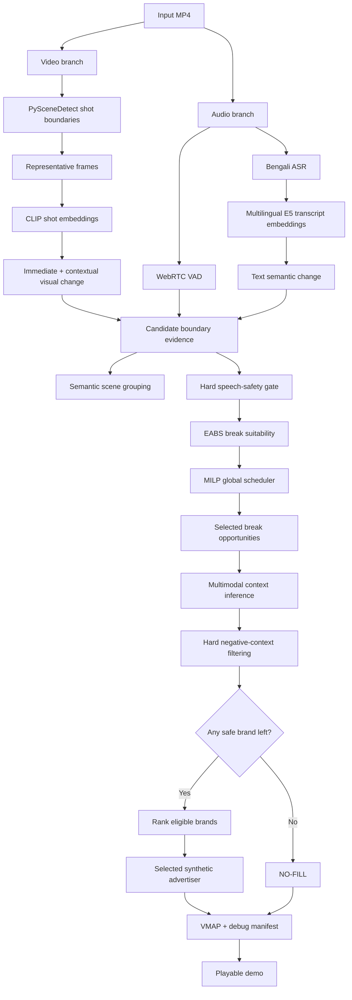

# AdContext
## Context-Aware Video Segmentation & Intelligent Ad Placement

**Hoichoi AI Builders Hackathon 2026 :: Problem 1**

AdContext is an end-to-end multimodal decision system for identifying natural ad opportunities in long-form Bengali video, enforcing pacing constraints, matching contextually appropriate synthetic advertisers, and refusing delivery when a scene is commercially unsafe.

---

## Links

- **Live demo:** https://suharoy.github.io/hoichoi-ad-context/
- **GitHub repository:** https://github.com/suharoy/hoichoi-ad-context
---

## What AdContext Solves :

A visual cut is not automatically a good ad break. Long-form drama contains shot/reverse-shot editing, dialogue-heavy sequences, reaction cuts, montages, and visually strong transitions that may still occur in the middle of speech. Likewise, a technically good interruption point is not automatically a commercially safe place for every advertiser.

AdContext therefore separates the problem into three decisions:

1. **Where does the narrative structure change?**
2. **Where can playback be interrupted safely?**
3. **Which advertiser, if any, is safe and contextually appropriate there?**

The final system deliberately supports a fourth decision:

> **Do not serve an ad.**
That fail-closed behavior is essential when every advertiser conflicts with a detected hard-safety context.

---

# Results at a glance

## Development-set speech-safety comparison

| Placement strategy | Breaks | Speech-safe breaks | Detected speech interruption |
|---|---:|---:|---:|
| Fixed 5-minute baseline | 17 | 2 | **88.2%** |
| Visual-only CLIP transitions | 14 | 1 | **92.9%** |
| **AdContext production pipeline** | **14** | **14** | **0.0%** |

These figures use VAD-based speech interruption as an objective proxy. They are **not human perceptual-quality ground truth**.

The result demonstrates an important property of dialogue-heavy content: **a strong visual transition alone is not sufficient evidence for an ad break**.

---

# Development / pseudo-held-out split

The supplied corpus contained six Bengali long-form videos.

Five titles were used for development, calibration and model-design decisions. One title was intentionally kept separate as an internal pseudo-held-out evaluation asset.

| Video | Approx. duration | Role |
|---|---:|---|
| `bhojon_bilashi.mp4` | 20:27 | Development |
| `indubala_bhaater_hotel.mp4` | 25:54 | Development |
| `mandaar.mp4` | 39:09 | Development |
| `mohanagar.mp4` | 23:17 | Development |
| `money_honey.mp4` | 21:42 | Development |
| `feluda.mp4` | 25:36 | **Pseudo-held-out evaluation** |

### Important Terminology

This project does **not** train CLIP, E5 or the ASR model from scratch.

The five development titles are used for:

- empirical calibration,
- semantic-scene threshold fitting,
- break-scoring design,
- optimization validation,
- brand-matching development,
- baseline comparison.

`feluda.mp4` is kept outside those development decisions and used as an **internal pseudo-held-out evaluation** after the core pipeline is frozen.

This is separate from any organizer-side hidden test set.

---

# Why Feluda is not accepted by the public local-video player ?

The public GitHub Pages demo intentionally exports only the five development-title decision manifests in:

```text
docs/data/model-manifest.json
```

Therefore the **Load local source video** tab accepts:

```text
bhojon_bilashi.mp4
indubala_bhaater_hotel.mp4
mandaar.mp4
mohanagar.mp4
money_honey.mp4
```

but does **not** accept:

```text
feluda.mp4
```

This is deliberate. Feluda is treated as pseudo-held-out evaluation evidence and is kept separate from the development manifest so that the test result is not silently mixed back into the development/demo set.

The Feluda evaluation can be reproduced locally with:

```powershell
python scripts/evaluate_feluda.py
```

provided the supplied `feluda.mp4` asset is present locally.

The original Hoichoi source videos are not redistributed through this repository or GitHub Pages.

---

# Pseudo-held-out Feluda evaluation

`feluda.mp4` was excluded from:

- EABS calibration and threshold fitting,
- development break-selection tuning,
- development brand-matching decisions,
- semantic-scene calibration.

It was evaluated only after the core system was frozen.

## Feluda Result

| Metric | Result |
|---|---:|
| Visual boundaries | 346 |
| Speech-safe boundaries | 68 |
| Scored candidates | 35 |
| Scheduled break opportunities | 3 |
| Delivered ads | 2 |
| Safety no-fills | 1 |
| Negative-context violations | **0** |
| Minimum selected gap | 387.28 s |
| Frozen calibration unchanged | Yes |
| Frozen pacing policy unchanged | Yes |
| Frozen taxonomy unchanged | Yes |

### Selected Decisions

| Time | EABS | Delivery decision |
|---|---:|---|
| 05:02.000 | 73.77 | Orivox Tech |
| **12:10.040** | **58.82** | **NO-FILL — hard safety context `death`; 9/9 brands blocked** |
| 18:37.320 | 65.06 | Tavira Travel |

The 12:10 result demonstrates a central design principle:

> **Interruption suitability and advertising suitability are separate decisions.**

The boundary itself was suitable enough to survive break-quality selection. The commercial-safety layer then detected a hard safety context and removed every advertiser, so the content continues with **no ad inserted**.

---

# System Architecture



---

# High-level Procedure

```text
MP4
 │
 ├── Video
 │    ├── shot-boundary detection
 │    └── representative-frame CLIP embeddings
 │
 └── Audio
      ├── speech / non-speech detection
      └── timestamp-local Bengali ASR
             │
             ▼
      candidate boundaries
             │
             ├── hard reject if speech crosses boundary
             ├── acoustic pause evidence
             ├── contextual visual transition evidence
             └── semantic text-change evidence
                     │
                     ▼
                  EABS
                     │
                     ▼
              global MILP optimizer
       min-gap / max-breaks / ad-load
                     │
                     ▼
            selected break opportunities
                     │
                     ▼
            semantic context inference
                     │
             hard negative filtering
                     │
          ┌──────────┴──────────┐
          │                     │
    eligible brands         none eligible
          │                     │
      brand ranking             NO-FILL
          │                     │
          └──────────┬──────────┘
                     │
                     ▼
              VMAP + audit JSON
                     │
                     ▼
                web player
```

---

# 1. Visual Structure

PySceneDetect AdaptiveDetector identifies low-level visual shot boundaries.

The five development videos contain:

```text
1,465 internal visual boundaries
```

A shot boundary is treated only as a **candidate structural event**. It is not automatically interpreted as a semantic scene or an ad break.

Representative frames are encoded with:

```text
openai/clip-vit-base-patch32
```

For each boundary, the system measures:

- immediate shot-to-shot change,
- contextual change between up to two shots before and two shots after.

The contextual representation helps reduce false importance from ordinary shot/reverse-shot editing.

---

# 2. Bengali Speech and Semantic Evidence

Audio is analyzed with WebRTC VAD.

A candidate receives a hard rejection when:

- detected speech crosses the boundary, or
- the boundary lies inside detected speech.

Speech-safe candidates are enriched with timestamp-local Bengali ASR using:

```text
OpenVoiceOS/ai4bharat-indicconformer-bn-onnx
```

Local transcript windows are represented with:

```text
intfloat/multilingual-e5-small
```

Semantic change is calculated from embeddings on the two sides of a candidate boundary.

Short transcript fragments are down-weighted using a reliability term rather than being treated as equally trustworthy.

---

# 3. Semantic Scene Segmentation

Low-level visual shots are grouped into higher-level semantic scene intervals.

The scene-grouping evidence uses:

- contextual CLIP visual change,
- Bengali text-semantic change,
- transcript reliability.

No target number of scenes was manually chosen.

Visual and textual separation thresholds were estimated from the five development titles using one-dimensional Otsu separation:

```text
visual threshold = 0.156857
text threshold   = 0.154849
```

Consecutive strong transitions are collapsed to the strongest member of the run so a burst of adjacent edits does not become several artificial semantic scenes.

### Development Result

```text
1,465 visual boundaries
441 raw strong transitions
163 retained semantic boundaries
168 semantic scenes
```

Scene-duration statistics:

```text
median  : 35.98 s
mean    : 46.60 s
p90     : 102.55 s
```

Semantic scenes are used as **explanatory narrative structure**.

They do not modify the frozen EABS scoring objective or optimizer.

Among the 14 selected development breaks:

```text
4 / 14 exactly coincide with a semantic-scene boundary
6 / 14 are within 2 seconds
9 / 14 are within 5 seconds
```

This supports an important distinction:

```text
semantic scene transition
        OR
safe intra-scene interruption point
```

Both can be legitimate ad opportunities.

---

# 4. Evidence-Aware Break Suitability Score  (EABS)

Each eligible candidate is scored using three evidence channels:

- **A** — acoustic pause evidence,
- **V** — contextual visual change,
- **T** — Bengali semantic change.

Raw modality values are converted into development-only empirical percentiles so heterogeneous signals become comparable without assuming a Gaussian distribution.

For text reliability `r`:

```text
EABS = 100 × (A + V + rT) / (2 + r)
```

with:

```text
0 <= A, V, T, r <= 1
```

EABS is an **interpretable relative suitability index**, not a calibrated probability.

The neutral point is:

```text
EABS = 50
```

Candidates at or below 50 have non-positive optimization utility and do not consume ad inventory.

---

# 5. Global Pacing Optimization

Choosing high-scoring timestamps independently can still produce a poor schedule.

AdContext formulates break placement as a binary mixed-integer optimization problem using:

```text
scipy.optimize.milp / HiGHS
```

Objective:

```text
maximize Σ(EABS_i - 50) x_i
```

subject to pacing constraints.

The current development/demo policy is:

```text
minimum first break      120 s
minimum end buffer       120 s
minimum break gap        300 s
maximum breaks/hour      4
maximum nominal ad load  8%
nominal creative length  30 s
```

This policy is a **development/demo policy** and is not represented as an organizer-provided specification.

The optimizer can leave inventory unused rather than inserting a below-neutral break.

---

# 6. Context Inference and Brand Matching

After break selection, local scene context is represented using:

- multilingual E5 text embeddings,
- CLIP visual-text embeddings,
- an inspectable context taxonomy.

Ordinary contexts include examples such as:

```text
food
cooking
dining
family
conversation
work
finance
education
technology
travel
driving
indoor
outdoor
```

Safety-sensitive contexts include:

```text
violence
weapon
injury
medical_emergency
death
grief
crime
police
fear_threat
```

Ordinary context retrieval uses multimodal rank fusion.

---

# 7. Hard Negative-Context Safety

Advertiser `negative_contexts` are **hard exclusions**, not soft ranking penalties.

```text
detect hard safety context
        │
        ▼
remove conflicting advertisers
        │
        ├───────────────┐
        │               │
safe advertisers     none remain
        │               │
rank safe brands       NO-FILL
```

A selected advertiser appearing in the blocked set is treated as a system error.

The VMAP generator also omits safety no-fills, ensuring playback is not interrupted when no advertiser is commercially safe.

---

# 8. Catalogue-driven unseen-brand handling

Brand behavior is data-driven.

Each catalogue record contains:

```text
brand_id
description
positive_contexts
negative_contexts
activities
creative_uri
```

There are no title-specific advertiser assignments.

For the pseudo-held-out evaluation, a ninth synthetic advertiser was introduced:

```text
Nivara Books
```

No code path was added for it.

On Feluda:

```text
participated in ranking on 2 breaks
best rank: 4
selected: 0
```

The purpose is not to force the unseen brand to win; it is to verify that unseen catalogue entries participate through the same generic ranking path.

---

# 9. Fail-closed delivery

A scheduled opportunity can resolve to:

```text
filled
```

or:

```text
no_fill_brand_safety
```

A no-fill is permitted only when every catalogue advertiser has been explicitly removed by the hard safety filter.

If safe brands remain but ranking returns nothing, the system treats that as an implementation failure rather than silently producing a no-fill.

This invariant is enforced across:

- brand matching,
- debug-manifest generation,
- VMAP generation,
- API validation,
- player behavior,
- regression tests.

---

# 10. VMAP and audit output

For each processed video the system can produce:

```text
debug-manifest.json
vmap/<video>.vmap.xml
```

The debug manifest preserves:

- break timestamp,
- EABS,
- acoustic evidence,
- visual evidence,
- text evidence,
- semantic-scene relationship,
- inferred contexts,
- hard safety contexts,
- blocked brands,
- brand ranking,
- selected brand,
- delivery status,
- no-fill reason.

The VMAP contains **only deliverable ads**.

Safety no-fill decisions remain visible in the audit record but do not create playback interruptions.

---

# Public Demo

The live site is deployed through GitHub Pages:

**https://suharoy.github.io/hoichoi-ad-context/**

It provides three modes.

## 1. Live synthetic demo

A copyright-safe generated video fixture demonstrates the player mechanics:

```text
content playback
→ scheduled interruption
→ synthetic ad
→ automatic content resume
```

The fixture timestamp is explicitly **not** presented as a model-evaluation result.

## 2. Model evidence

Shows frozen development-title decisions without redistributing the source videos.

It exposes:

- semantic scene counts,
- break timestamps,
- EABS,
- scene relation,
- context cues,
- selected synthetic advertiser,
- safety state.

## 3. Load local source video

A user who already possesses one of the supplied development MP4s can choose it locally.

The browser creates a local object URL:

```text
local MP4
→ browser only
→ never uploaded
```

The frozen break decisions are then applied to the real local media.

---

# Baseline evaluation

The project intentionally compares the production pipeline against simpler alternatives.

## Baseline A : fixed periodic placement

```text
every 5 minutes
```

This ignores content entirely.

## Baseline B : visual-only placement

Select the strongest CLIP contextual shot transitions while ignoring speech and transcript evidence.

## Production

```text
hard speech safety
+ multimodal EABS
+ global MILP pacing
```

Aggregate development result:

```text
Periodic      15 / 17 detected speech interruptions
Visual-only   13 / 14 detected speech interruptions
Production     0 / 14 detected speech interruptions
```

Again, this is a **speech-safety proxy**, not a human perceptual-quality score.

---

# Evaluation Discipline

The project follows a development workflow closer to model validation than to visual demo tuning:

```text
baseline
→ development-only fitting
→ freeze calibration
→ evaluate
→ inspect failures
→ engineering fix only when required
```

Examples include:

- empirical CDF calibration,
- development-derived semantic-scene thresholds,
- fixed EABS neutral baseline,
- greedy optimization baseline,
- periodic baseline,
- visual-only baseline,
- pseudo-held-out evaluation,
- file-hash verification for frozen assets,
- explicit documentation of post-evaluation engineering changes.

The first Feluda evaluation exposed a legitimate delivery edge case: every advertiser could be hard-blocked.

The engineering response was to introduce fail-closed no-fill behavior.

No EABS weights, calibration distributions, semantic thresholds, context taxonomy, ranking weights or pacing parameters were changed based on that Feluda outcome.

---

# Repository Structure

```text
hoichoi-ad-context/
│
├── configs/
│   ├── brands.demo.json
│   ├── brands.heldout.json
│   ├── break_score_calibration.json
│   ├── context_taxonomy.json
│   ├── pacing.demo.json
│   └── scene_segmentation.json
│
├── src/
│   ├── api/
│   ├── audio/
│   ├── brand_matching/
│   ├── break_scoring/
│   ├── context/
│   ├── ingestion/
│   ├── manifest/
│   ├── optimization/
│   └── segmentation/
│
├── scripts/
│   ├── profile_boundaries.py
│   ├── enrich_text_semantics.py
│   ├── enrich_visual_semantics.py
│   ├── score_boundaries.py
│   ├── optimize_breaks.py
│   ├── segment_semantic_scenes.py
│   ├── match_brands.py
│   ├── generate_manifests.py
│   ├── evaluate_baselines.py
│   ├── evaluate_feluda.py
│   └── build_public_demo.py
│
├── tests/
│
├── frontend/
│   └── local FastAPI demo UI
│
├── docs/
│   ├── index.html
│   ├── data/
│   └── media/
│       └── synthetic-fixture.mp4
│
├── outputs/
│   └── generated local artifacts, ignored by Git
│
├── pyproject.toml
└── README.md
```

---

# Local media layout

The supplied media is intentionally kept outside Git:

```text
Hackathon/
│
├── hoichoi-ad-context/
│
└── hoichoi-assets/
    ├── bhojon_bilashi.mp4
    ├── feluda.mp4
    ├── indubala_bhaater_hotel.mp4
    ├── mandaar.mp4
    ├── mohanagar.mp4
    └── money_honey.mp4
```

---

# Key models and methods

| Component | Method / model |
|---|---|
| Shot boundaries | PySceneDetect AdaptiveDetector |
| Speech / silence | WebRTC VAD |
| Bengali ASR | `OpenVoiceOS/ai4bharat-indicconformer-bn-onnx` |
| Text semantics | `intfloat/multilingual-e5-small` |
| Visual semantics | `openai/clip-vit-base-patch32` |
| Semantic scenes | multimodal change + development-fitted Otsu separation |
| Break score | EABS with empirical percentile calibration |
| Scheduling | `scipy.optimize.milp` / HiGHS |
| Brand context | E5 + CLIP multimodal rank fusion |
| Brand safety | deterministic hard negative-context filtering |
| Delivery | VMAP + audit manifest + HTML5 player |

---

# Reproducing the key stages

From the repository root:

```powershell
$env:PYTHONPATH = (Get-Location).Path
$env:DISABLE_SAFETENSORS_CONVERSION = "1"
```

Run tests:

```powershell
python -m pytest -q
```

Generate / refresh semantic scenes:

```powershell
python scripts/segment_semantic_scenes.py
```

Optimize development break placement:

```powershell
python scripts/optimize_breaks.py
```

Match advertisers:

```powershell
python scripts/match_brands.py
```

Generate VMAP and debug manifests:

```powershell
python scripts/generate_manifests.py
```

Run the development baseline comparison:

```powershell
python scripts/evaluate_baselines.py
```

Run the pseudo-held-out Feluda evaluation:

```powershell
python scripts/evaluate_feluda.py
```

Build copyright-safe public demo assets:

```powershell
python scripts/build_public_demo.py
```

Run the static public site locally:

```powershell
python -m http.server 8080 -d docs
```

Then open:

```text
http://localhost:8080
```

---

# Design principles

## AI where perception is needed

Learned models are used for:

- visual semantic representation,
- Bengali language representation,
- multimodal context retrieval.

## Statistics where calibration is needed

The system uses:

- empirical reference distributions,
- percentile calibration,
- text reliability,
- development-derived transition separation,
- pseudo-held-out evaluation.

## Optimization where global constraints matter

Scheduling is formulated as a constrained binary optimization problem rather than a chain of independent local decisions.

## Deterministic rules where safety matters

Negative-context conflicts are hard blocks.

A semantic model is never allowed to override a hard brand-safety exclusion.

## Auditability throughout

The system retains enough evidence to answer:

```text
Why is this a good interruption point?
Why this advertiser?
Why was another advertiser blocked?
Why was no ad served?
```

---

# Engineering / ML focus

AdContext was designed as a decision system rather than a collection of model API calls.

The project combines:

- multimodal representation learning,
- statistical calibration,
- Bengali-language processing,
- semantic scene segmentation,
- constrained optimization,
- ranking / recommendation,
- safety constraints,
- baseline evaluation,
- pseudo-held-out validation,
- explainable decision traces,
- production-style manifest generation,
- public deployment.

The core engineering idea is:

> **Use learned models to estimate noisy evidence, then make consequential decisions through explicit, inspectable constraints.**

This keeps the system measurable, testable and easier to reason about than a single opaque end-to-end model call.

---

# Limitations

- VAD-based speech safety is an automated proxy, not manually annotated ground truth.
- Semantic scenes are development-calibrated approximations rather than editor-provided scene labels.
- Context cues are retrieval outputs, not calibrated class probabilities.
- The advertiser catalogue is synthetic and exists for the hackathon demonstration.
- The pacing configuration is a development/demo policy rather than an organizer-provided specification.
- The public site intentionally does not redistribute supplied Hoichoi media.
- Feluda is an internal pseudo-held-out evaluation, not a substitute for organizer-side hidden evaluation.
- The public local-video player intentionally exposes only development-title manifests.

---

# Submission links

### Live demo
https://suharoy.github.io/hoichoi-ad-context/

### Source repository
https://github.com/suharoy/hoichoi-ad-context


---

# Author

**Suha Roy**

Built for the **hoichoi AI Builders Hackathon 2026**.

The implementation emphasizes:

```text
statistical modelling
multimodal machine learning
semantic understanding
decision optimization
recommendation / ranking
model evaluation
explainability
reproducible engineering
```

The project is intentionally aligned with a data-science / ML-engineering approach: measure noisy evidence, calibrate it, formulate decisions under constraints, validate against baselines, and preserve auditability from model output to final delivery.
